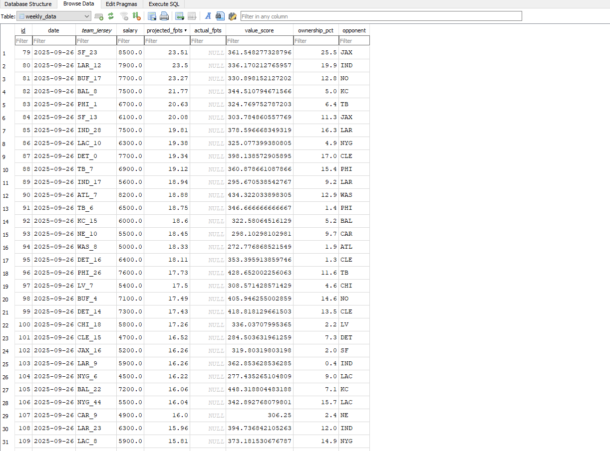

# NFL DFS Data Pipeline

A data collection and storage system for daily fantasy sports (DFS) research that aggregates player projections, salaries, and ownership data into a normalized database.



## Features

- **Automated Player Database**: Scrapes complete NFL roster data from ESPN's API
- **Unique Player Identification**: Uses team + jersey number as primary key to handle name variations across data sources
- **API Integration**: Fetches DFS projections directly from RotoWire's API
- **Intelligent Name Matching**: Fuzzy matching algorithm connects player names between RotoWire and ESPN
- **Database Storage**: SQLite database with normalized schema for tracking weekly projections

## Technical Stack

- Python 3.x
- Selenium (for initial scraping)
- Requests (for API calls)
- SQLite3 (database)
- Pandas (data processing)

## Database Schema

### `players` table
Stores complete NFL roster with unique team_jersey primary keys (e.g., "SF_23")

### `weekly_data` table
Tracks DFS projections, salaries, ownership percentages, and opponents by week

### `player_stats` table
Reserved for actual performance data (planned feature)

## Setup

1. Install dependencies:
    ```bash
    pip install selenium requests pandas webdriver-manager

2. Create database:
    python database.py

3. Build player lookup:
    python player_lookup_py

4. Populate players table:
    python populate_players.py

5. Scrape weekly projections
    python scraper.py

## Results
    Successfully matched 384/422
    Handles full slate (14+ games)
    Stores projections with proper foreign key relationships

## Future Enhancements
    Statistical analysis (ceiling/floor projections using standard deviation)
    Track trends and pattern analysis
    Actual performance stats integration
    More data resources
    Line comparison across sports books for value


